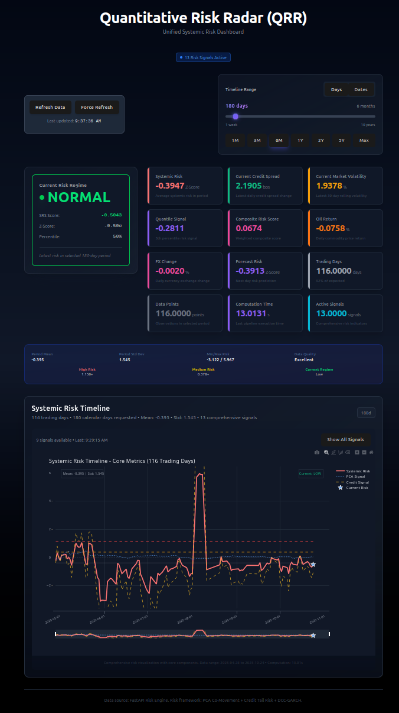

# Quantitative Risk Rotator (QRR)

The **Quantitative Risk Rotator (QRR)** is a **data-driven risk monitoring framework** for systemic risk detection and financial regime analysis. QRR moves beyond static financial ratios and uses dynamic modeling to identify when markets enter high-risk or crisis regimes.

It continuously tracks **cross-sector co-movement**, **volatility spillovers**, and **credit stress**, then aggregates these signals into a composite systemic risk index, providing a comprehensive view of market stress.

---

## App Usage: Detecting Stress Regimes

The primary goal of the QRR dashboard is to provide a real-time, actionable view of the current market stress level by analyzing key metrics and their evolution over time.



### Key Metrics to Monitor

| Metric | Interpretation | Stress Implication |
| :--- | :--- | :--- |
| **Current Risk Regime** | A categorical assessment (**low**, **medium**, **high**) determined by a weighted score of standardized PCA, Credit, and DCC signals. | **HIGH** signals a consensus among equity co-movement and credit/correlation stress models. |
| **Systemic Risk Score** | The core index, a normalized average of **PCA (co-movement)** and **Credit (funding stress)** signals. | **Positive values** suggest elevated systemic risk. Persistent readings $> 1$ standard deviation (high Z-score) are critical. |
| **Composite Risk Score** | A comprehensive, weighted average of **all** risk signals (Systemic, Quantile, DCC, HAR, etc.). | This is the most holistic stress indicator. High values imply multiple market areas are flashing warnings. |
| **DCC Correlation** | The latest output from the Dynamic Conditional Correlation model, tracking correlation between key sector pairs. | An **average correlation $> 0.7$** across pairs often results in a **highly\_correlated** regime, indicating markets are highly synchronized. |
| **Quantile Signal** | Measures extreme negative tail events in the High-Yield bond market (5th percentile HYG returns). | Highly **negative** values suggest a **"risk-off"** shift and liquidity stress in the credit market. |

### Analyzing the Systemic Risk Timeline

The **Systemic Risk Timeline** plots all computed signals. Look for:

* **Convergence:** When the **PCA**, **Credit**, and **DCC** lines all converge at high/extreme values simultaneously, it validates a systemic stress event.
* **Divergence:** A sharp rise in **PCA** without a corresponding drop in **Credit** might signal an equity-specific, non-credit-driven event.
* **The Risk Warning Indicator:** This flag shows specific historical points where the Systemic Score, DCC Correlation, or HAR Excess Volatility were in their extreme high percentiles.


---

## Methodology: The Engine of Risk Detection

The QRR framework leverages advanced models to ensure a multi-dimensional view of risk.

### 1. Unified Systemic Risk Score (The Core Index)
* **Calculation:** The **Unified Systemic Risk Score** is the average of the standardized (z-scored) **PCA** (Systemic Co-Movement) and **Credit** (Funding Stress) signals.
* **Interpretation:** This score measures the foundational connectivity and liquidity risk in the system.

### 2. Regime-Switching DCC (Dynamic Conditional Correlation)
* **Purpose:** To track the evolving correlation between key asset pairs (e.g., XLK vs XLF) and analyze how correlation changes under stress.
* **Implementation:** The **Risk Engine** uses a dedicated `RegimeSwitchingDCC` model, often initialized using asset returns (`SPY`, `XLF`, `XLK`, `HYG`) and a stress indicator derived from the **Systemic Score** itself.
* **Output:** Provides a **DCC Correlation** value, **pair-wise correlations**, and a **regime analysis** including the crucial **stress\_correlation\_contrast** (difference in correlation between stress and normal periods).

### 3. Quantile Regression
* **Purpose:** To analyze the tail-risk sensitivity of market returns to the systemic risk factors.
* **Implementation:** The Risk Engine computes **Quantile Regression** using available signals, focusing on the 5th and 95th percentiles to understand how the distribution's extremes behave relative to the signals.

### Aggregation and Regime Determination
The final **Current Risk Regime** is not solely based on the Systemic Score but on a **weighted regime score** using the Z-scores of:
$$\text{Regime Score} = 0.4 \cdot \text{Systemic Z} + 0.25 \cdot \text{PCA Z} + 0.2 \cdot \text{Credit Z} + 0.15 \cdot \text{DCC Z}$$
This multi-factor approach ensures the regime is robustly determined by co-movement, credit stress, and correlation contagion.

---

## Development Setup

QRR uses a modern Python/JavaScript stack:

* **Backend:** **FastAPI** for high-performance data serving and computation.
* **Analytics:** **Python/Pandas/Numpy/Arch** for core quantitative risk models.
* **Frontend:** **Vite** + **React** + **JavaScript** for a responsive, real-time dashboard.

### 1. API Key Setup

The backend uses the **FRED API** for certain macroeconomic data. You must set your API key in a local environment file.

1.  **Get a FRED API Key:** Register for a free key on the [FRED website](https://fred.stlouisfed.org/docs/api/api_key.html).
2.  **Create `.env` file:** In the root directory of the backend (where your main application file is located), create a file named `.env`.
3.  **Add Key:** Add your key to the file in the following format:

    ```
    FRED_API_KEY="YOUR_API_KEY_HERE"
    ```

### 2. Backend Setup & Run

The backend is built with FastAPI.

**Prerequisites:** Python 3.9+ and pip.

1.  **Navigate to the backend root directory:**

2.  **Create a virtual environment:**
    ```bash
    python -m venv venv
    source venv/bin/activate
    ```

3.  **Install dependencies:**
    The required packages are listed in `requirements.txt`.
    ```bash
    pip install -r requirements.txt
    ```

4.  **Run the application with Uvicorn:**
    ```bash
    uvicorn app.main:app --reload
    ```

    The backend will now be running, typically at `http://127.0.0.1:8000`.
    For Data pipeline debugging purpose go to `http://localhost:8000/analytics/debug/signal-generation`

### 3. Frontend Setup & Run

The frontend uses Vite and React.

**Prerequisites:** Node.js (which includes npm/yarn).

1.  **Install dependencies:**
    ```bash
    npm install
    # or
    yarn install
    ```

2.  **Run the application:**
    ```bash
    npm run dev
    # or
    yarn dev
    ```

    The frontend will typically open a browser window at `http://localhost:5173` (or similar port).

---

### Backend Components Deep Dive

#### 1. Data Pipeline (`app.services.data_pipeline.py`)

The data pipeline is responsible for collecting, validating, and merging all raw data into a single, clean, time-aligned DataFrame used by the risk engine.

| Function | Data Source(s) | Key Outputs | Purpose |
| :--- | :--- | :--- | :--- |
| `get_sector_data` | Yahoo Finance (Sector ETFs: XL\*) | Sector ETF Returns (`SPY`, `XLK`, `XLF`, etc.) | Feeds the **Rolling PCA** and **DCC Correlation** models. |
| `get_credit_signals` | Yahoo Finance (`HYG`, `TLT`, `LQD`), FRED | Credit ETF Returns, Spread Changes (`HY\_Spread\_Change`, `VIX\_Change`), Macro Data (`oil\_return`, `fx\_change`) | Feeds the **Credit Market Signal** and provides diagnostic macro inputs. |
| `get_full_market_dataset` | All above | A final, unified DataFrame | Aligns all market returns and macro/credit metrics and cleans data. |

#### 2. The Risk Engine (`app.core.risk_engine.py`)

The **`RiskEngine`** is the orchestrator of all analytical computations.

| Function | Purpose | Key Actions |
| :--- | :--- | :--- |
| `compute_full_risk` | Main entry point for the entire risk pipeline. | Orchestrates the calculation of **Systemic Score**, **DCC metrics**, and **Quantile Regression**. |
| `_calculate_comprehensive_risk_regime` | Determines the final **risk regime**. | Uses the weighted Z-score formula, integrating **Systemic**, **PCA**, **Credit**, and **DCC Z-scores**. |
| `compute_comprehensive_dcc_metrics` | Runs the specialized DCC analysis. | Computes **pair-wise correlations** and **regime analysis**. |